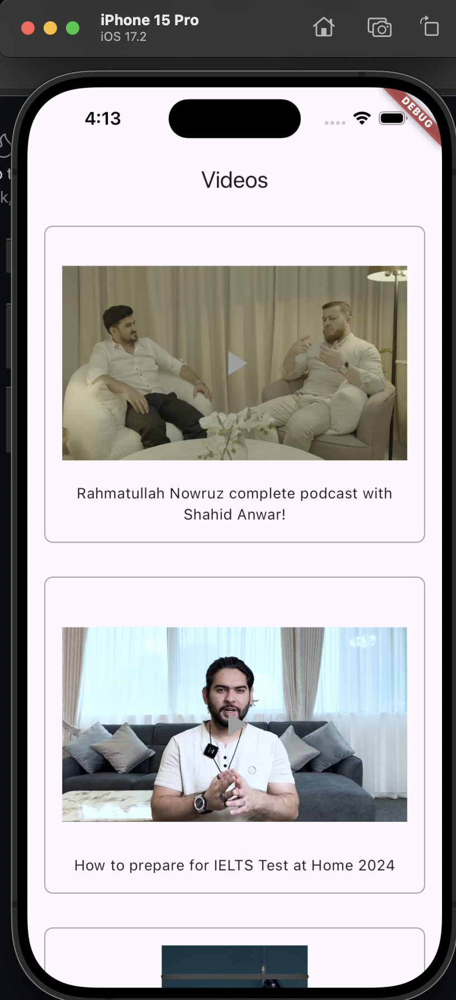

# Ulearna Application: Fetch and Display Data from BE - Social Media App 
Note this code miss dio helper (that have general response and http error handler to chech what is the error) - make file -  app theme.

## Project Overview

This Flutter application fetches data from an API, displays it with pagination and lazy loading, and implements caching for improved performance. The app adheres to clean architecture principles, uses the BLoC pattern for state management, and implements dependency injection.

## Features

- **Pagination:** Load more data as the user scrolls.
- **Lazy Loading:** Efficiently load data only when needed.
- **Caching:** Store fetched data locally to reduce repeated API requests.
- **Error Handling:** Gracefully handle and display errors during data retrieval.

## Requirements

1. **Flutter Framework:** Developed using Flutter.
2. **Data Retrieval:** Fetch data from [API](https://api.ulearna.com/bytes/all?page=1&limit=10&country=United States).
3. **Data Parsing:** Use Dart's built-in JSON decoding library.
4. **State Management:** Implement BLoC pattern.
5. **Dependency Injection:** Managed using a dependency injection framework.
6. **Architecture:** Follows clean architecture principles.

## Installation

1. **Clone the Repository:**

   ```bash
   git clone https://github.com/DimaGhanem1/ULearna_test.git
   


screenshot 
<div >
  <a href="https://github.com/othneildrew/Best-README-Template">
    
  </a>
</div>
